Welcome to the expvip-web wiki!
This wiki contains tutorials on how to setup the database and run it locally. 

**Updating the virtual machine** Before loading the metadata, double click on ```update_expvip.sh``` in the desktop to get the latest version of expVIP.  

1. [Loading Virtual Machine](LoadingVM). Instructions on how to setup Virtual Box to run expVIP
1. [Loading Metadata](LoadingMetadata). Detailed scripts in the virtual machine to prepare expVIP for your samples. 
1. [Loading data](LoadingData). Description on how to prepare and load the data to expVIP. 
1. [Running Kallisto](RunKallisto). Instructions on how to run Kallisto and load the results in the database in a single step
1. [Running Kallisto in batch](RunKallistoBatch). Instructions on how to run Kallisto and load the results in the database in a single step from multiple samples
1. [Starting up the web server](StartWebServer). Instructions on how to start the local web server for expVIP
1. [Exporting Data](ExportData). How to extract data from expVIP database.
1. [Graphical Interface Tutorial](https://github.com/homonecloco/expvip-web/wiki/Tutorial-expVIP-Graphical-Interface-(Wheat-Expression-Browser-example)). How to get the most of the expVIP graphical interface, exemplified with the [Wheat Genome Browser](http://www.wheat-expression.com/).

# Loading Virtual Machine #

The ```expVIP``` Virtual Machine (VM) allows you to analyse your own RNA-Seq expression experiments locally.  


## Requirements ##

The virtual machine requires:

* [VirtualBox](https://www.virtualbox.org), version 5 or newer.
* 6GB of RAM
* A 64-bit operating system running on an x86_64 architecture. (Intel, AMD)
* 10GB of free space. 


## Default data ##
The default values loaded in the virtual machine are available in this [link](https://www.dropbox.com/sh/n15tpsqj92wfn8u/AABivEEUj4sRd9tG830WnSi4a?dl=0). These correspond to the wheat data from Borrill, Ramirez-Gonzalez and Uauy, 2015 (_submitted_).

You can get a virtual machine with expVIP installed with either the wheat data preloaded or an empty database for your analysis [here](https://www.dropbox.com/sh/73i7ulj1hk6gdpd/AAARGuJDN0MnaZ7iLmMzSSp9a?dl=0).

### Available VMs ###
1. **expVIPNoData.ova** This VM is ready to use, but it has no data on it. You can load a custom set of RNA-seq reads, transcriptome reference and metadata. 
1. **expVIPwithWheatData.ova** This has all the data loaded from [www.wheat-expression.com](http://www.wheat-expression.com). You can add your own data and compare it with the values of publicly available experiments. 


## Setup shared folders ##

To load your custom RNA-seq experiments, you have to setup a shared folder with your input files. This shared folder will contain the data and information required by the VM to implement expVIP and it provides the "connection" between your computer and the VM. This shared folder should include:   

1. RNA-seq reads: as ```fastq``` or ```fq.gz``` files.
1. Transcriptome reference: currently only the cdna fasta file from ensembl is supported. 
1. Metadata: this includes two separate files; one factor file and one metadata file ([explained here] (https://github.com/homonecloco/expvip-web/wiki/LoadingMetadata)).  

Some important information:

* The shared folder must contain one sub-folder per each set of RNA-seq reads. So for example if you wish to analyse data from three samples, you will need three sub-folders (one each with the individual sample RNA-seq reads)
* Each RNA-seq sub-folder must be named with the same accession number that you use in your metadata (see [here] (https://github.com/homonecloco/expvip-web/wiki/LoadingMetadata)).
* If you wish to add your own wheat data to that previously provided in www.wheat-expression.com you will need to include sub-folders with your RNA-seq reads and then modify the metadata files: ```default_metadata.txt``` and ```FactorOrder.tsv``` which are provided in the ```expVIPwithWheatData.ova``` or can be downloaded [here](https://www.dropbox.com/sh/n15tpsqj92wfn8u/AABivEEUj4sRd9tG830WnSi4a?dl=0). Additional factors and metadata can be added at the end of these files following similar nomenclature as that already present in the files. 


## Loading the virtual machine ##

Download the ```ova``` virtual machine and double click it. Virtual Box will open it. Accept the default options. 

If The virtual machine is not loaded, go to the menu ```File``` and click ```Import appliance```. Open the ```.ova``` you want to use 


Availabe VMs:
* ```expVIP.ova``` expVIP is installed with an empty database. This VM requires to setup your own samples. 
* ```expVIPwithWheatData.ova``` expVIP is installed with the wheat expression data, transcriptome reference and metadata. This VM allows the inclusion of additional samples to integrate with the previously analysed wheat data.  

1. On the Oracle VM VirtualBox Manager select expVIP and click on the settings button
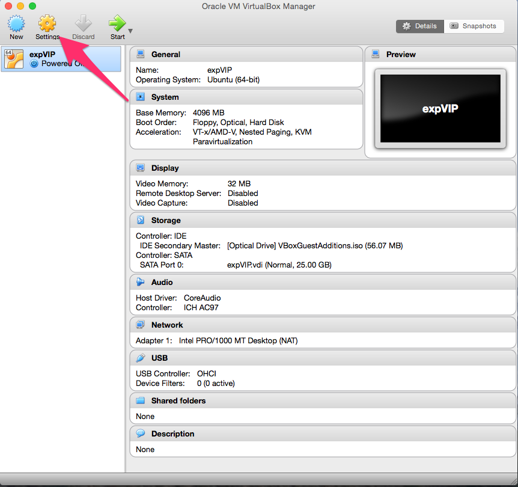
1. Click in ```Shared folders```
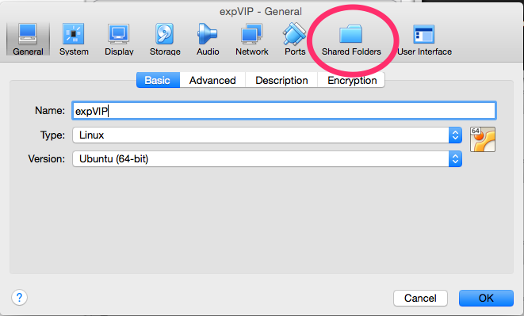
1. Add a new folder 
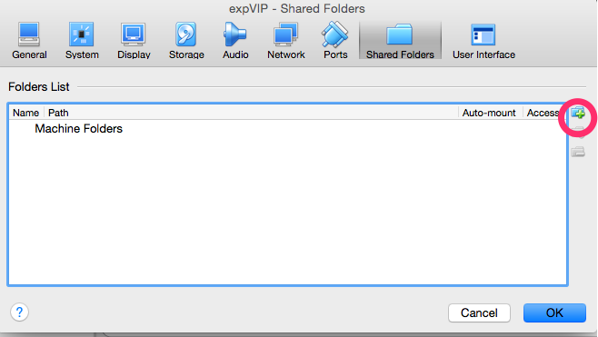
1. Search the ```Folder path``` with the experiments and the files with the metadata


1. Select the folder

1. Make sure that the ```Auto-mount``` option is selected. 

1. Accept the settings


## Starting the virtual machine ##
Select ```expVIP``` from the VM list and press start. 
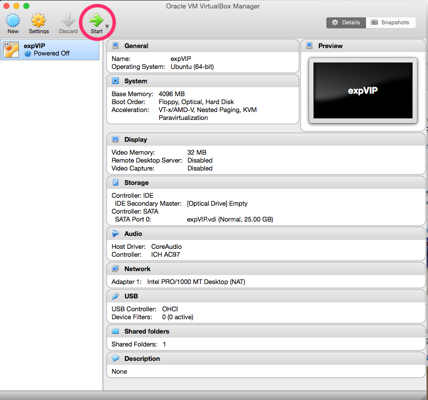


## NOTES ##
[kallisto](http://pachterlab.github.io/kallisto/about.html) is included as part of the virtual machine and is free for non-commercial use. However, it requires a license for commercial use. The distribution of kallisto, with the corresponding license is included in ```~/software/``` in the VM.  


# Loading expVIP metadata #

This tutorial covers the shell scripts that can be used to load the metadata with the graphical interface, with screenshots, and the rake task, to be run in the command line, if you are more comfortable in the terminal. The assumption is that expVIP is located in ```~/expvip-web/```

##Loading ```factor file``` ##
The first thing to do is to setup the available factors. The ```factor file``` is a text file, where each field is separated by tabs. A header is necesary on each column. The headers are the following:

* **factor**: The name of the factor to group. These must match those used in the metadata file (see below).
* **order**: Default display order in the graphical interface.
* **name**: The long name of the grouped factor. These must match those used in the metadata file (see below). 
* **short**: Short name of the grouped factor. This is used in the graphical interface when many factors are displayed.


###```factor file``` example:###

```
factor	order	name	short
Age	1	7 days	7d
Age	2	seedling stage	see
Age	3	14 days	14d
Age	4	three leaf stage	3_lea
Age	5	24 days	24d
Age	6	tillering stage	till
Age	7	fifth leaf stage	5_lea
Age	8	1 cm spike	1_sp
Age	9	two nodes detectable	2_no
Age	10	flag leaf stage	f_lea
Age	11	anthesis	anth
Age	12	2 dpa	2dpa
Age	13	4 dpa	4dpa
High level age	1	seedling	see
High level age	2	vegetative	veg
High level age	3	reproductive	repr
High level stress-disease	1	none	none
High level stress-disease	2	disease	dis
High level stress-disease	3	abiotic	abio
High level stress-disease	4	transgenic	trans
High level tissue	1	spike	spike
High level tissue	2	grain	grain
...
```

### Wizard to load factors ###

1. Double click in  ```load_factors.sh``` in the desktop

1. When  prompted, run execute in terminal 

1. By default, the script goes to ```/media```, which is the folder containing the ```shared folders``` that we have setup in the [LoadingVM](LoadingVM) step. 

1. If the factors are loaded correctly, a pop up window will notify about it

1. If there was an error loading the factors, a message will notify about it.  The error log may give a hint of what went wrong, but if you can't figure out send a screenshot of the terminal to the developers. 


### Rake task ###

To load the factors, you can run directly the rake task from ```~/expvip-web/```. 

```
rake load_data:factor[FILE_WITH_FACTORS]; 
```

## Loading metadata ##


The second step is to load the experiment metadata. Currently, a tab separated file is the input and it **must** contain the following columns with the header named exactly as stated:

* **secondary\_study\_accession**: The accession number for experiments carried as part of a single study. This is usually the high level BioProject or SRA number. 
* **run\_accession**: The accession of the individual run. 
* **scientific\_name**: of the species. 
* **experiment\_title**: A description for the individual RNA-seq sample.
* **study\_title**: A description of the general study.
* **Variety** 
* **Tissue**
* **Age**
* **Stress-disease**
* **Manuscript**: The DOI of the study.
* **Group\_for\_averaging** A description of the experiment. This must be the same all the replicates in the same study. 
* **Group\_number\_for\_averaging**: A short name for replicated experiments.  
* **Total reads**: (optional)
* **Mapped reads**: (optional)
* **High level variety**: A higher level grouping to get summarized data of the factors. 
* **High level tissue**
* **High level age**
* **High level stress-disease**

### Important points ###


* ```Variety```, ```Tissue```, ```Age```, ```Stress-disease```, and their corresponding ```High level``` factors must be exactly the same as in the columns ```factor``` and ```name``` from the ```factor file``` (see above). 
* The graphical interface will group samples based on these factors. Therefore these can be defined based on the user needs. For example the factor ```High level tissue``` will include tissue types such as ```grain```, ```roots```, ```spike``` and ```leaves/shoots```. Within each of these tissue types, a more detailed description can be included under the ```Tissue``` heading. For example: ```starchy endosperm```, ```seed coat```, ```transfer cells```, etc. RNA-seq samples which share factor names in common will be displayed as groups in the visual interface.
* If ```Mapped reads``` and ```Total reads``` are missing, you need to run ```kallisto``` mapping from the ```rake``` task. 


### Using the graphical interface ###

The process is similar to loading the factors. However, the metadata file is selected. 

1. Double click on the ```load_metadata.sh``` icon in the desktop

1. Choose execute in terminal

1. Select the metadata file


### Rake task ###

```sh
rake load_data:metadata[FILE_WITH_THE_METADATA]
```

## Loading the gene sets ##
Before loading the actual expression data or running kallisto, it is necessary to load the gene models. Currently, only the fasta file with the cdna from ensembl is supported. The fasta header should contain the following fields, besides the gene name (first string in the header).

* **cdna**
* **chromosome** or **scaffold** are converted to position
* **gene** 
* **transcript** 
* **description** a free text, in quotes. Any other field with quotes may fail in the load. 

Besides the fasta file, it is necessary to give a name to the gene set. For this tutorial, the ```gene_set``` will be ```IWGSC2.26```
	
### Example fasta file ###

```
>Traes_5BL_3FC5BA305.1 cdna:novel scaffold:IWGSC2:IWGSC_CSS_5BL_scaff_1082268:5:199:-1 gene:Traes_5BL_3FC5BA305 transcript:Traes_5BL_3FC5BA305.1
TGCTGCTGCTAGGCTTGAAGAGGTTGCTGGCAAGCTCCAGTCTGCTCGGCAGCTCATTCA
GAGGGGCTGTGAGGAGTGCCCCAAGAACGAGGATGTTTGGTTCGAGGCATGCCGGTTGGC
TAGCCCAGATGAGTCAAAGGCAGTAATTGCCAGGGGTGTGAAGGCAATTCCCAACTCTGT
GAAGCTGTGGCTGCA
>Traes_6BL_9BB648D51.1 cdna:novel scaffold:IWGSC2:IWGSC_CSS_6BL_scaff_430516:302:1741:-1 gene:Traes_6BL_9BB648D51 transcript:Traes_6BL_9BB648D51.1
TCCCTATCTGTTTCCTTGGCAGCTCCCTGATCCAATCGATCCATCAGGGCTCGACTAACT
TCTTCCAGCGCCTCTTCAGCGCGGGAGATCTACCAGCGTCGGCGGAGGGGCGTAGGTGCA
GGCGTGCAGCCCAAGTCCGCACCCGGCTCTAGGTTTCTGCTAATCTTCTTCCACCTGTGA
TACGCGCTCCGGGGCTAGGAGCACTCGTTGCCGGCTGCCTCGTGCTCGGAATGGCGGATG
```
### Graphical interface ###

1. Double click on the ```load_gene_set``` script

1. Select ```Execute in Terminal```

1. Here you can name the gene set. 

1. And select the reference file. This may take a few minutes to load.

1. Successfully loaded genes


### Rake task ###
```sh
rake load_data:ensembl_genes[IWGSC2.26,/Triticum_aestivum.IWGSC2.26.cdna.all.fa]
```

##Loading the homoeologues ##
In order to show the homoeologues, a file with the homoeologies must be loaded. The file is tab separated with the following format:

```
Gene	A	B	D	Group	Genome
Traes_5BS_0AFC3F795		Traes_5BS_0AFC3F795	Traes_5DS_C204EBAA9	5	B
Traes_5DS_C204EBAA9		Traes_5BS_0AFC3F795	Traes_5DS_C204EBAA9	5	D
Traes_7DL_82360D4EE1			Traes_7DL_82360D4EE1	7	D
Traes_2AL_1368BE0AD	Traes_2AL_1368BE0AD	Traes_2BL_CD459994C1		2	A
...
```

Note that the gene names are not the same as the transcript names, they correspond to the gene name. 

### Generating the file with the homoeologues from Ensembl compara ###

The file can be genrated with ensembl compara, using the following query:

```sql
SELECT 
	homology_member.homology_id, cigar_line, perc_cov, perc_id, perc_pos, 
	gene_member.stable_id as genes, 
	gene_member.genome_db_id

FROM 
    homology_member 
INNER JOIN homology USING (homology_id) 
INNER JOIN method_link_species_set USING (method_link_species_set_id) 
INNER JOIN gene_member USING (gene_member_id)
WHERE method_link_species_set.name="T.aes homoeologues";
```
Then, to format the result of the query (saved as ```compara_homology.txt```), you can use the provided script

```sh
ruby bin/homologyTable.rb compara_homolgy.txt homology.txt homology_counts.txt
```

You can get your homoeologies elsewhere, as long as you keep the file format. 

At this point, the homoloeologues are called A,B and D. This is going to change on a future release to allow any chromosome group naming. 


1. Double click on the ```load_homoeologues.sh``` script

1. Select ```Execute in Terminal```

1. Here you can name the gene set. It must be the same name you added for the gene reference. 

1. And select the homoeologues file. 

1. Succesfully loaded. At the end of the log you can see which how many homologies where loaded.


### Rake task ###


```sh
rake load_data:homology[IWGSC2.26,/homology.txt]
```

#Data loading#

Once the database has been created, expVIP currently supports two methods to load expression data onto the database: 

1. Load the precomputed expression values into the database, or 
1. Run kallisto to generate the expression data. These are then loaded directly into the database. 

## Single big table ##

The fastest way to load the data to expVIP is to produce a table with all the values for each expression unit (tpm, counts). The table must contain a column ```target_id``` that has the gene name, as the first field in the fasta file used for the mapping. The rest of the columns most contain a header with the accession of the experiment. Each row represents a value. All the values in the table must be from the same time. 

For the case of wheat in which we have already generated the kallisto mapping of 418 RNA-seq studies, the expression table can be downloaded directly from [here](https://www.dropbox.com/sh/n15tpsqj92wfn8u/AABivEEUj4sRd9tG830WnSi4a?dl=0). The ```txt``` files are called ```final_output_counts.txt``` and ```final_output_tpm.txt``` for the corresponding expression unit. 


### Loading from the script ###

1. Double click on the ```load_values.sh```
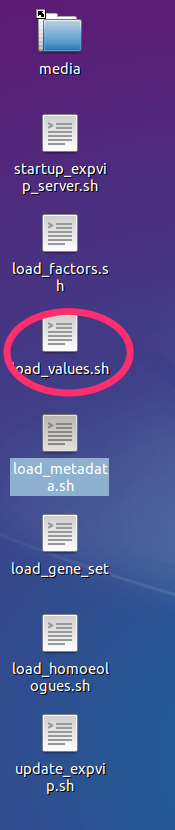 
1. Click one ```Execute in Terminal```

1. Select a name for the set of alignments. expVIP can keep several runs of alignments in the database. The ability to select between them will be added in a future release. 

1. The names of the gene set must be the same used when loading the metadata
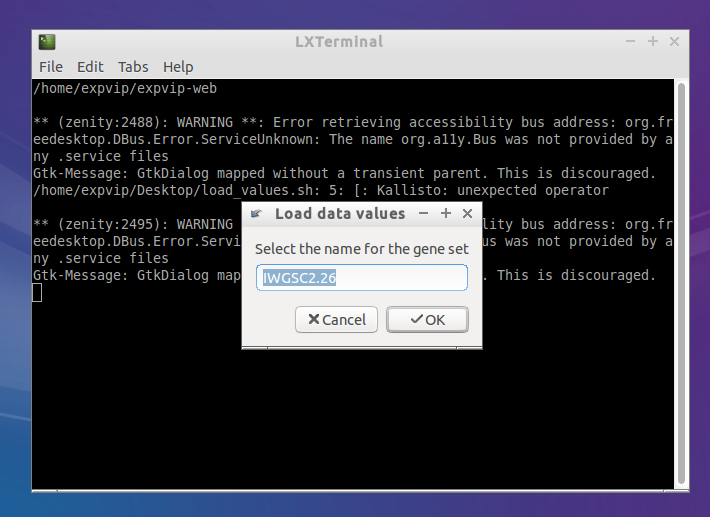
1. Select the file with the big table. The process takes some time, so be patient. 

1. An alert comes when the data finished loading. 
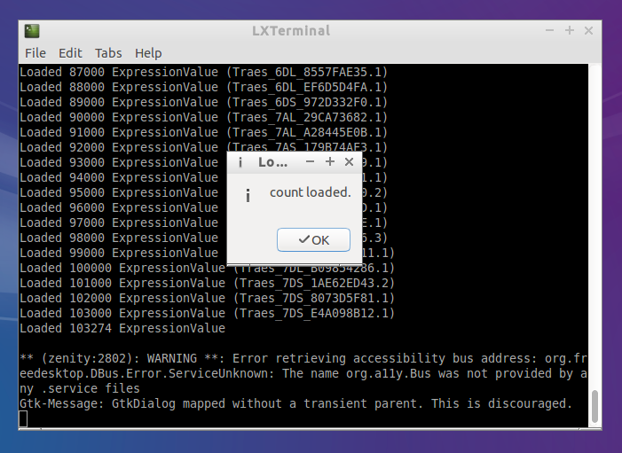

If the accession numbers are not the same as in the metadata the process will fail. 

### Rake Task ###
In order to load the data, the task ```load_data:values``` is provided. For example, to load the tpm, the following command is used. 

```sh
rake "load_data:values[First run,IWGSC2.26,tpm,edited_final_output_tpm.txt]"
```


## Running Kallisto ##

You can load the data directly to the database provided that you generated the ```Kallisto``` index on your reference:


```
kallisto index --index=Triticum_aestivum.IWGSC2.26.cdna.all.fa.kallisto.k31 Triticum_aestivum.IWGSC2.26.cdna.all.fa
```

You can modify the index options as you find it suitable for your experiment.

To run Kallisto on single sample, the following task is available:

```
rake kallisto:runAndStorePaired[Index,folder/with/samples/ACCESSION,experiment_title,IWGSC2.26]
```

The task requires that the reads are in a folder named exactly as the ```secondary\_study\_accession*``` column in the metadata file. If the accession doesn't exist, the task will fail. ```experiment_title``` is a name to group alignments. 
# Run Kallisto on a single sample #
expVIP can run ```Kallisto``` and load the ```tpm``` and ```counts``` to the database. The only requirement is to run ```kallisto index ``` on the transcriptome reference. 

## Graphical interface
1. Double click on ```run_kallisto.sh```
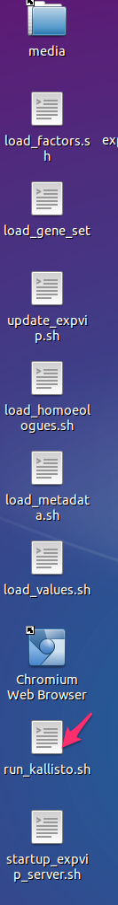
1. Click on ```Execute on terminal```
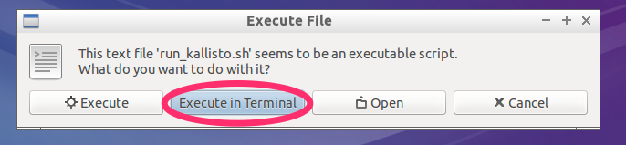
1. Give a name to the set of mappings to be grouped. All mappings done with the same reference and preference should have the same name. 
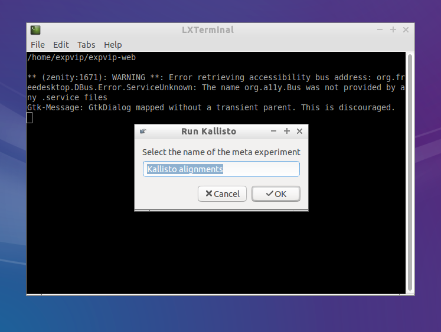
1. Get the name of the reference. This name must be the same used when loading the [metadata](LoadingMetadata) 
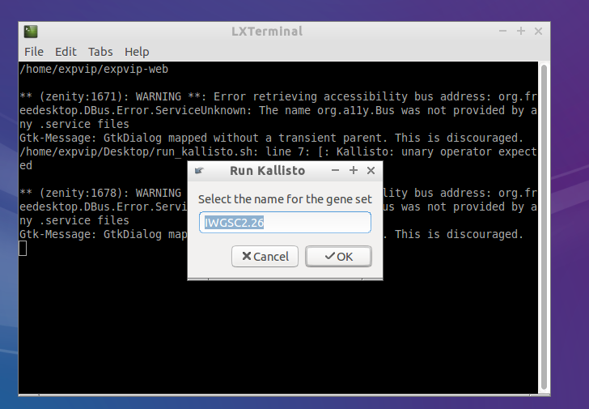
1. Select a folder with the reads. The reads must be paired reads. The folder name must be the same as the ```accession``` used on the metadata. 
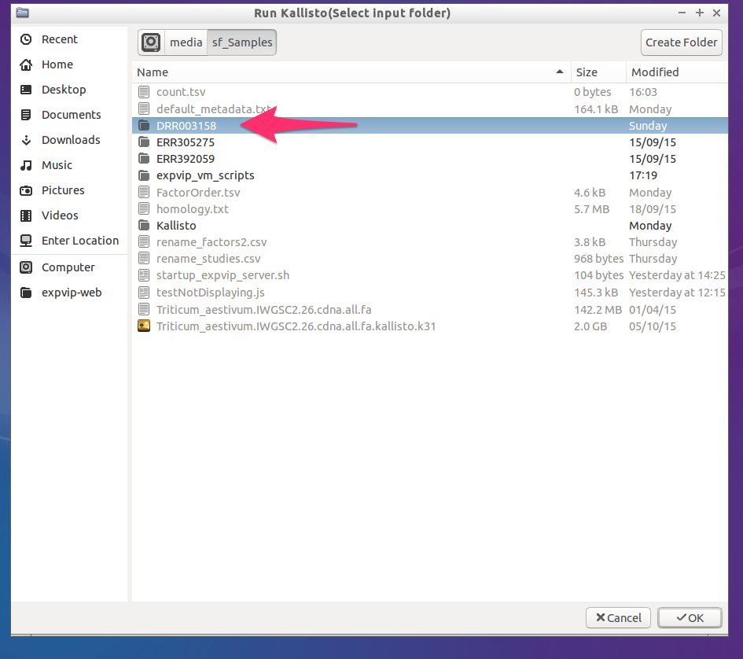
1. Select the kallisto index
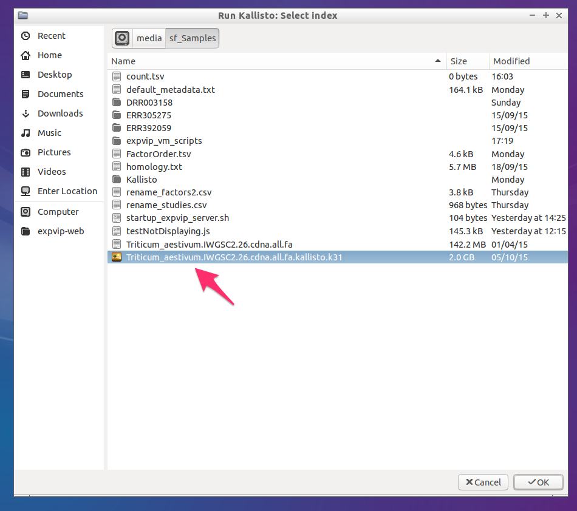
1. Wait for Kallisto to run and load the data


You can reepeat this with all the samples or you can use the [batch load](RunKallistoBatch). 

## Rake task ##


```sh
kallisto:runAndStorePaired[kallistoIndex,input_folder,metaExperimentName,geneSetName]
```

Where ```metaExperimentName``` is the name of the group of alignments under the same conditions and ```geneSetName`` is the name of the reference. 
# Run Kallisto on a multiple samples #
expVIP can run ```Kallisto``` and load the ```tpm``` and ```counts``` to the database from multiple samples. The only requirement is to run ```kallisto index ``` on the transcriptome reference. 

## Graphical interface
1. Double click on ```run_kallisto.sh```

1. Click on ```Execute on terminal```

1. Give a name to the set of mappings to be grouped. All mappings done with the same reference and preference should have the same name. 

1. Get the name of the reference. This name must be the same used when loading the [metadata](LoadingMetadata) 

1. Select a folder with the folders containing the reads. The reads must be paired reads. The subfolder names must be the same as the ```accession``` used on the metadata.  If a subfolder has an experiment that has been loaded already, it is not loaded.

1. Select the kallisto index

1. Wait for Kallisto to run and load the data


Repeat this with all the samples. 

## Rake task ##


```sh
kallisto:runAndStorePairedFolder[kallistoIndex,input_folder,metaExperimentName,geneSetName]
```

Where ```metaExperimentName``` is the name of the group of alignments under the same conditions and ```geneSetName`` is the name of the reference. 

#Starting expVIP web server#

Once the data is loaded, you can visualize the the expression in the expVIP virtual machine.  

1. Double click on ```start_expvip_server.sh``` 

1. Click on ```Execute on terminal```
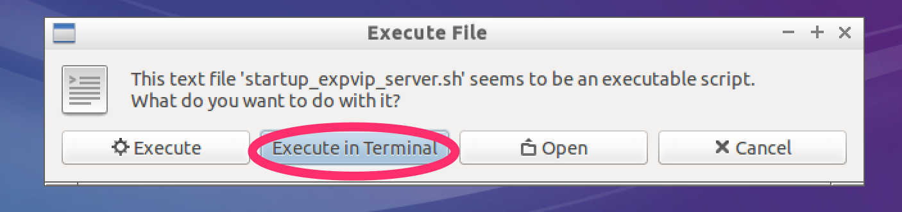
1. Wait fot the webserver to start. You know it is ready when the line ```WEBrickHTTPServer#start: pid=xxxx port=3000``` appers in the console 

1. Double click in Chromium Web Broser. 
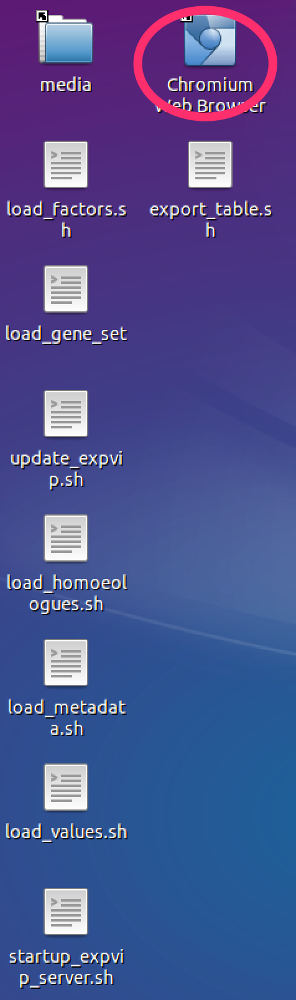
1. Your local instance of expVIP is running! 


# Export data #

The data loaded in ```expVIP``` can be exported to be run in DESeq2, or any other software to do differential expression analysis.  

## Wizard to export data ##

1. Double clicl on the the ```export_tables.sh``` script

1. Execute it on the terminal
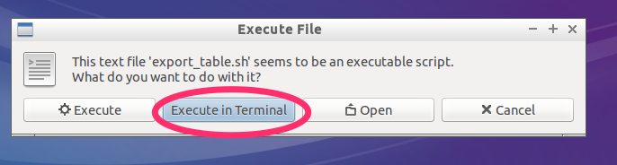
1. Select the value you want to export. If you have used ```Kallisto```, the available options are ```count``` and ```tpm```. If you imported the data manually, it will be whatever units you inserted

1. Select a location for the output file. It is suggested to export it in the shared folder with the host machine. 
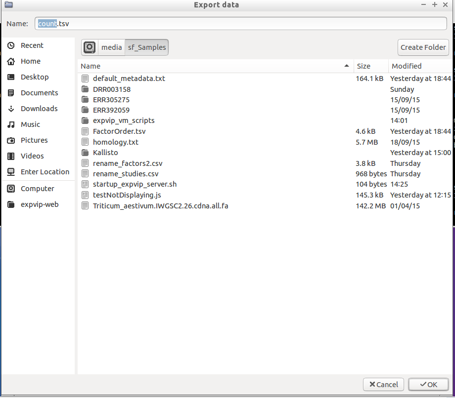

## Rake tast ##


```sh
rake "export:values[tpm,tpm.csv]"
```

# Abundance files #
To use Sleuth, the abundance files from the ```Kallisto``` runs can be grabed from the folder ```kallisto``` inside the folder with reads. 

The abundance files for the runs in the VM and in [wheat-expression.com](http://www.wheat-expression.com) can be found in thie [here]( https://www.dropbox.com/sh/dap4eer67qfe9om/AADEyXZ393jY9czjAlArsemma?dl=0).


## Troublshooting ##


If you get an error like this:

```
ActiveRecord::StatementInvalid: Mysql2::Error: Error writing file '/tmp/MYg0xdqm' (Errcode: 28 - No space left on device):
```

You can try increasing the size of the virtual machine disk or install expVIP in a dedicated workstation.  The best thing to do is to download the precalculated tables from the expVIP website and add the columns with your experiment at the end of the table. 

 

This tutorial is based on the [```Wheat Expression Browser```](http://www.wheat-expression.com/). However, the principles are the same for any transcriptome study which is powered by the expVIP graphical interface. 

#**Home Page** #

The home page allows the user to insert a gene name to search and to define which studies are to be included in the visualisation interface. By default all studies are selected, but users can select/deselect a study by simply clicking on the specific button.
 
You can also compare expression between two genes by introducing both gene names in the boxes and pressing the  ```Compare``` button. 

Alternatively you can compare expression across multiple genes (up to 50) to generate a heatmap. You can add a list of genes separate by commas or one gene per line in the ```Multiple genes``` box.

All gene names are based on the transcriptome reference used for expVIP: for the case of the Wheat Expression Browser we used the IWGSC transcriptome available through [Ensembl Plants](http://plants.ensembl.org/Triticum_aestivum/Info/Annotation/#genebuild) release 26. 

# **Visualisation interface**
## **Single gene or two-gene comparison**

Once the gene expression loads the page includes several features. These are shown below and explained point by point: 


**Figure 1:** Overall description of features on Wheat Expression Browser

1. **```Search box```**: at any point you can type or copy a new gene name (based on Ensembl Plants nomenclature) and generate a new set of expression data.
1. **```Compare box```**: you can type a second gene name and press the ```Compare``` button to generate two expression graphs drawn at the same scale.
1. **```Menu options```**: this includes a series of links to different options:  
  * **```Home```**: return to ```home``` screen.
  * **```Studies```**: opens up a popup screen with a summary and short description of each study and a link to manuscript.
  * **```Download```**: link to download all the wheat expression database including ```tpm``` and ```counts``` and associated metadata.
  * **```Add your data```**: link to GitHub to download virtual machine.
  * **```Tutorials```**: link to Wheat Expression Browser Tutorial.
  * **```Videos```**: link to Wheat Expression Browser Video Tutorial.

1. **```Gene```**: shows the gene which is currently being displayed with link to Ensembl Plants gene page.
1. **```Expression unit```**: allows user to select the expression unit used to visualise the expression data. This can be either “transcript per million (```tpm```)” or “estimated counts (```counts```)”. We have not provided RPKM given the inconsistencies generated across samples when using this measure. A detailed discussion can be found in [Wagner _et al_](http://www.ncbi.nlm.nih.gov/pubmed/22872506) (2012). It is important to mention that ```tpm``` is preferred over RPKM since it allows an easier comparison for abundances between samples. However it is important to stress that while ```tpm``` serves as a relative measure to compare genes across experiments, a proper normalisation and statistical analysis with differential gene expression programs must be performed. ```expVIP``` generates outputs which allow easy implementation of ```sleuth```, ```DESeq``` and ```EdgeR```.
1. **```Save graph```**: these two buttons allow users to save the current graphs in either ```SVG``` (to work on Adobe Ilustrator) or as ```PNG``` files. The graphical file will render based on the current selection and order of factors as displayed on the screen.
1. **```Save data```**: this allows the user to download a ```csv``` file with the data based on the current selection and order of factors as displayed on the screen. The data will include the standard errors and the number of samples that make up each value. 
1. **```Homoeologues```**: by clicking on this button, the ```Wheat Expression Browser``` will display the expression graphs of known homoeologues of the original primary gene. This gene name will remain in bold and the homoeologous graphs will be displayed according to A, B, D genome ordering. When homoeologues are displayed the same expression scale is used across graphs and the sorting and filtering of factors is simultaneous to allow easier comparison. 
1. **```Gene names```**: gene name for corresponding graph. When homoeologues are shown the original gene used for the search is shown in bold. 
1. **```Expression level```**: the expression level adjusts according to the expression of each set of gene homoeologues. The scale remains consistent across homoeologues to allow easier comparison. The values are based on the unit selected in the ```expression unit``` box (see point 5 above).

**Figure 2:** Overall description of features on Wheat Expression Browser (continued)
1. **```Filter```**: This feature open a pop-up window which reveals all the levels within the particular category. All levels are pre-selected, but users can choose to display specific levels by selecting or deselecting them accordingly. If a level is deselected, then the data associated with this factor is removed from the graph. Within the pop-up window levels can also be re-arranged according to the user’s preference by dragging the level to the specific position within the pop-up window (see Features section below).
1. **```Display/hide category```**: Each individual category can be displayed or hidden by pressing the ```+/-``` button. When a category is displayed, the expression graphs will re-arrange according to the new category which has been introduced. If a category is hidden, then the graphs will also adjust accordingly. Data is not removed when doing this, rather it is grouped within the categories selected such that the total samples displayed remains the same. The colours within the category correspond to unique values or levels (up to 24 different colours) and are also used in the bar graphs corresponding to the expression data.  
1. **```Expression bars```**: These bars represent the expression level of the “n” samples which are grouped according to the factors chosen based on the selection criteria (11 and 12 above). When hovering over the bar with the mouse a small tooltip will indicate the expression level (```tpm``` or ```counts```) and the standard error (sem) used for the error bars (see 14)
1. **```Error bars```**: Standard error of the means for the “n” expression values on which the bar graph is based. 
1. **```Factors```**: Coloured rectangles represent the categories which are displayed according to the factors chosen based on the selection criteria (11 and 12 above). When hovering above the rectangles a tooltip will appear to show the long name of the level being examined. 
1. **```Description```**: Text description of the factors chosen based on the selection criteria (11 and 12 above) and the number of RNAseq samples (n) which meet this specific criterion.

	## **Multiple gene comparisons**

1. **```Expression unit```**: For heatmaps, log2(tpm) is suggested as the expression unit as this provides better resolution to compare multiple genes across several categories.

1. **```Heatmap```**: Expression data is represented as a heatmap. As for single genes, categories can be sorted and filtered using the same tools. Gene names appear on the top of each column. Currently, up to 50 genes can be visualised in one heatmap. In Figure 3, for example, the two right-most genes are expressed solely in grains, with one being expressed to higher levels as suggested by the dark blue colour. 
1. **```Scale```**: Colour scale for the expression values in the heatmap. The values adjust according to the highest tpm value being displayed within the current heatmap visualisation. Since tpm values below 2 are considered as very low expressed genes and log2 values of tpm<1 result in negative expression values, we forced tpm values below 1 to have a log2 value of cero (i.e. log2(<1)=0).  


**Figure 3:** Description of features on Wheat Expression Browser using Multiple gene comparisons.


## **Features** ##

### **Sorting** ###
Factors can be sorted within each category in two ways. 

1. The first is by simply clicking the mouse on top of the coloured rectangles underneath the heading. For example in Figure 2 samples are sorted on ```High level age``` from ```seedling``` (red), ```vegetative``` (blue) to ```reproductive``` (green). If the user clicks on any of the coloured rectangles in the ```High level tissue``` category, then the graph is automatically reorganised based on this factor. In this case it includes four categories as defined by the user in the metadata and the bar graphs on the right hand side change colour according to the latest factor used for sorting. The previous factor used (in this case ```high level age```) remains as a secondary sorting factor (Figure 3). 

**Figure 4:** Example of new sorting of data based on clicking of rectangles within “high level tissue”.
1. Alternatively, the user can define the exact order of factors within the browser interface. To do so the ```filter``` option (point 11 above) can be used. By clicking on the double arrow button the user opens a pop-up window which shows the levels within the factor. In this example by pressing the double-arrow underneath ```high level tissue``` a pop-up with four levels appears based on the order as determined in the user defined metadata (```spike```, ```grain```, ```leaves/shoots```, ```roots```). To rearrange this, the user can simply click, hold and drag the level to the desired position. This will automatically re-arrange the data based on the new order and the corresponding graph and legends will follow suit. The bottom panel of Figure 5 shows a new order of ```roots```, ```leaves/shoots```, ```spike``` and ```grain```.

**Figure 5:** Example of sorting of data based on new user defined order within the filter pop-up window.

### **Filtering** ###
In cases it may be required to remove certain samples from the visualisation. Note that displaying or hiding a category (point 12 above) does not remove the underlying data from the visualisation: this just simply groups the data within the selected category. Therefore to remove samples from the visualisation the user can open the filter pop-up as described for the ```Sorting``` option. Individual levels within the category can then be removed by using the “check-box” on the left hand side of the level name. By de-selecting a given level (in the example for Figure 6 we have deselected ```leaves/shoots``` and ```spike```), samples defined as such will be removed from the analysis and will not be shown in the bar graphs. In Figure 6 now only two levels remain (```roots``` and ```grains```) and hence the bar graphs only show these two levels. Notice that the numbers of samples which comprise each bar graph are the same as those on Figure 5. The pop-up window also includes an ```all``` and ```none``` option to rapidly select/deselect individual samples. The filtering option can be used on any factor: for example to remove a complete study from the analysis the easiest way is to select the ```study``` filtering pop-up on the far left and deselect the study in question. 


**Figure 6:** Example of filtering data based on user defined selection within the filter pop-up window.


