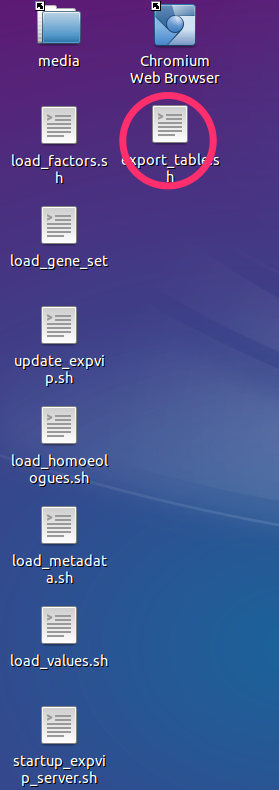
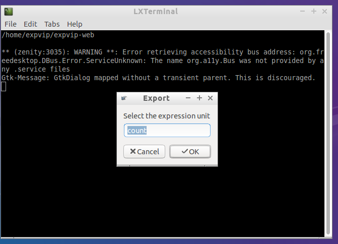

# Export data #

The data loaded in ```expVIP``` can be exported to be run in DESeq2, or any other software to do differential expression analysis.  

## Wizard to export data ##

1. Double clicl on the the ```export_tables.sh``` script

1. Execute it on the terminal

1. Select the value you want to export. If you have used ```Kallisto```, the available options are ```count``` and ```tpm```. If you imported the data manually, it will be whatever units you inserted

1. Select a location for the output file. It is suggested to export it in the shared folder with the host machine. 


## Rake tast ##


```sh
rake "export:values[tpm,tpm.csv]"
```

# Abundance files #
To use Sleuth, the abundance files from the ```Kallisto``` runs can be grabed from the folder ```kallisto``` inside the folder with reads. 

The abundance files for the runs in the VM and in [wheat-expression.com](http://www.wheat-expression.com) can be found in thie [here]( https://www.dropbox.com/sh/dap4eer67qfe9om/AADEyXZ393jY9czjAlArsemma?dl=0).


## Troublshooting ##


If you get an error like this:

```
ActiveRecord::StatementInvalid: Mysql2::Error: Error writing file '/tmp/MYg0xdqm' (Errcode: 28 - No space left on device):
```

You can try increasing the size of the virtual machine disk or install expVIP in a dedicated workstation.  The best thing to do is to download the precalculated tables from the expVIP website and add the columns with your experiment at the end of the table. 
