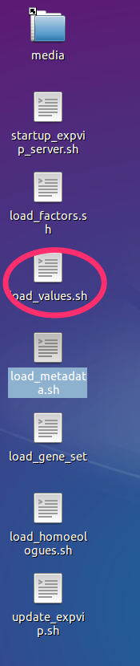
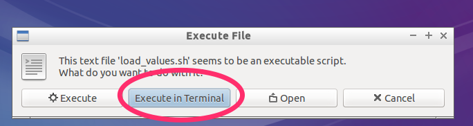
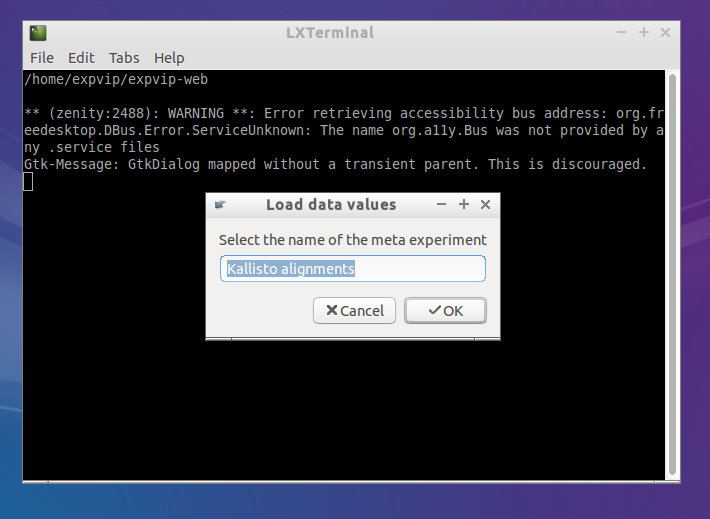
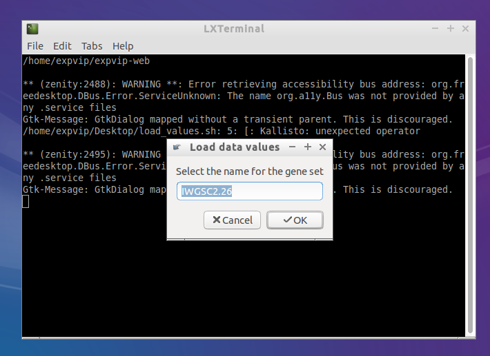
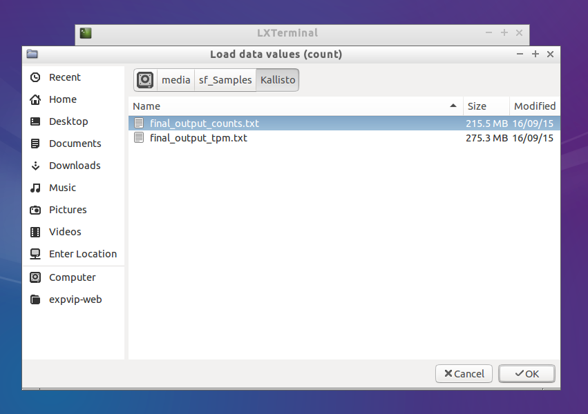
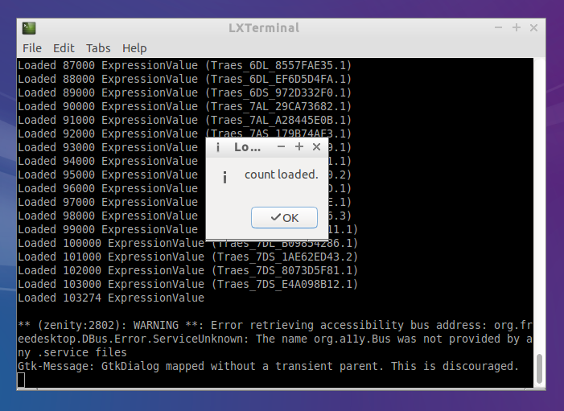

#Data loading#

Once the database has been created, expVIP currently supports two methods to load expression data onto the database: 

1. Load the precomputed expression values into the database, or 
1. Run kallisto to generate the expression data. These are then loaded directly into the database. 

## Single big table ##

The fastest way to load the data to expVIP is to produce a table with all the values for each expression unit (tpm, counts). The table must contain a column ```target_id``` that has the gene name, as the first field in the fasta file used for the mapping. The rest of the columns most contain a header with the accession of the experiment. Each row represents a value. All the values in the table must be from the same time. 

For the case of wheat in which we have already generated the kallisto mapping of 418 RNA-seq studies, the expression table can be downloaded directly from [here](https://www.dropbox.com/sh/n15tpsqj92wfn8u/AABivEEUj4sRd9tG830WnSi4a?dl=0). The ```txt``` files are called ```final_output_counts.txt``` and ```final_output_tpm.txt``` for the corresponding expression unit. 


### Loading from the script ###

1. Double click on the ```load_values.sh```
 
1. Click one ```Execute in Terminal```

1. Select a name for the set of alignments. expVIP can keep several runs of alignments in the database. The ability to select between them will be added in a future release. 

1. The names of the gene set must be the same used when loading the metadata

1. Select the file with the big table. The process takes some time, so be patient. 

1. An alert comes when the data finished loading. 


If the accession numbers are not the same as in the metadata the process will fail. 

### Rake Task ###
In order to load the data, the task ```load_data:values``` is provided. For example, to load the tpm, the following command is used. 

```sh
rake "load_data:values[First run,IWGSC2.26,tpm,edited_final_output_tpm.txt]"
```


## Running Kallisto ##

You can load the data directly to the database provided that you generated the ```Kallisto``` index on your reference:


```
kallisto index --index=Triticum_aestivum.IWGSC2.26.cdna.all.fa.kallisto.k31 Triticum_aestivum.IWGSC2.26.cdna.all.fa
```

You can modify the index options as you find it suitable for your experiment.

To run Kallisto on single sample, the following task is available:

```
rake kallisto:runAndStorePaired[Index,folder/with/samples/ACCESSION,experiment_title,IWGSC2.26]
```

The task requires that the reads are in a folder named exactly as the ```secondary\_study\_accession*``` column in the metadata file. If the accession doesn't exist, the task will fail. ```experiment_title``` is a name to group alignments. 
