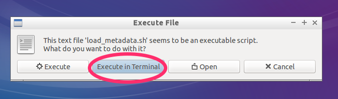
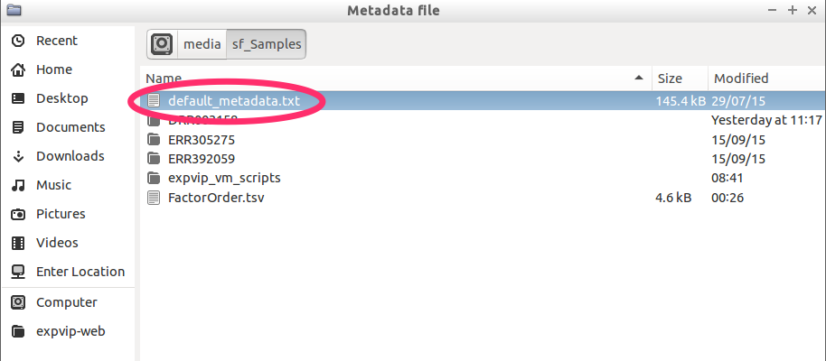
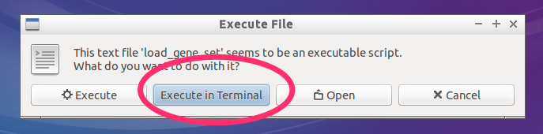
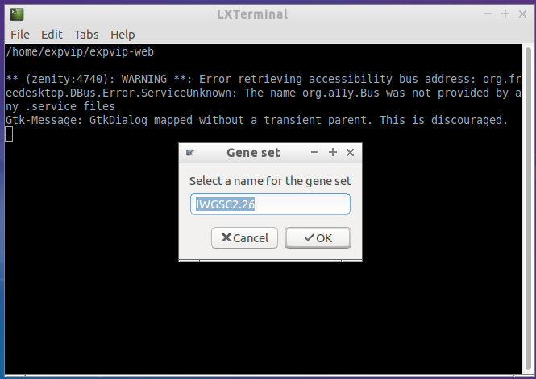
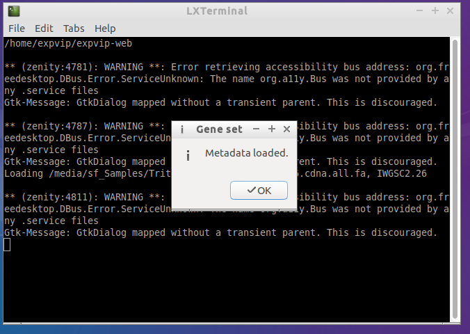
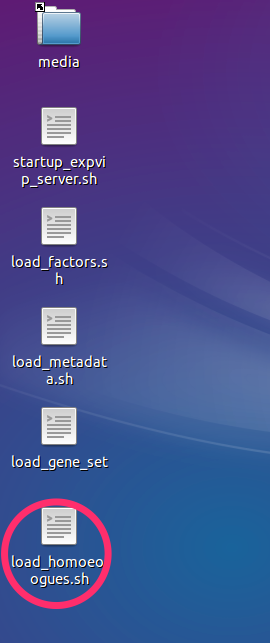
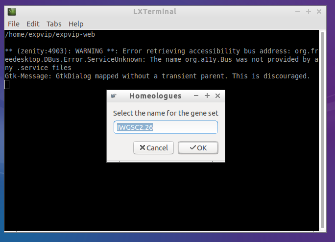

# Loading expVIP metadata #

This tutorial covers the shell scripts that can be used to load the metadata with the graphical interface, with screenshots, and the rake task, to be run in the command line, if you are more comfortable in the terminal. The assumption is that expVIP is located in ```~/expvip-web/```

##Loading ```factor file``` ##
The first thing to do is to setup the available factors. The ```factor file``` is a text file, where each field is separated by tabs. A header is necesary on each column. The headers are the following:

* **factor**: The name of the factor to group. These must match those used in the metadata file (see below).
* **order**: Default display order in the graphical interface.
* **name**: The long name of the grouped factor. These must match those used in the metadata file (see below). 
* **short**: Short name of the grouped factor. This is used in the graphical interface when many factors are displayed.


###```factor file``` example:###

```
factor	order	name	short
Age	1	7 days	7d
Age	2	seedling stage	see
Age	3	14 days	14d
Age	4	three leaf stage	3_lea
Age	5	24 days	24d
Age	6	tillering stage	till
Age	7	fifth leaf stage	5_lea
Age	8	1 cm spike	1_sp
Age	9	two nodes detectable	2_no
Age	10	flag leaf stage	f_lea
Age	11	anthesis	anth
Age	12	2 dpa	2dpa
Age	13	4 dpa	4dpa
High level age	1	seedling	see
High level age	2	vegetative	veg
High level age	3	reproductive	repr
High level stress-disease	1	none	none
High level stress-disease	2	disease	dis
High level stress-disease	3	abiotic	abio
High level stress-disease	4	transgenic	trans
High level tissue	1	spike	spike
High level tissue	2	grain	grain
...
```

### Wizard to load factors ###

1. Double click in  ```load_factors.sh``` in the desktop

1. When  prompted, run execute in terminal 

1. By default, the script goes to ```/media```, which is the folder containing the ```shared folders``` that we have setup in the [LoadingVM](LoadingVM) step. 

1. If the factors are loaded correctly, a pop up window will notify about it

1. If there was an error loading the factors, a message will notify about it.  The error log may give a hint of what went wrong, but if you can't figure out send a screenshot of the terminal to the developers. 


### Rake task ###

To load the factors, you can run directly the rake task from ```~/expvip-web/```. 

```
rake load_data:factor[FILE_WITH_FACTORS]; 
```

## Loading metadata ##


The second step is to load the experiment metadata. Currently, a tab separated file is the input and it **must** contain the following columns with the header named exactly as stated:

* **secondary\_study\_accession**: The accession number for experiments carried as part of a single study. This is usually the high level BioProject or SRA number. 
* **run\_accession**: The accession of the individual run. 
* **scientific\_name**: of the species. 
* **experiment\_title**: A description for the individual RNA-seq sample.
* **study\_title**: A description of the general study.
* **Variety** 
* **Tissue**
* **Age**
* **Stress-disease**
* **Manuscript**: The DOI of the study.
* **Group\_for\_averaging** A description of the experiment. This must be the same all the replicates in the same study. 
* **Group\_number\_for\_averaging**: A short name for replicated experiments.  
* **Total reads**: (optional)
* **Mapped reads**: (optional)
* **High level variety**: A higher level grouping to get summarized data of the factors. 
* **High level tissue**
* **High level age**
* **High level stress-disease**

### Important points ###


* ```Variety```, ```Tissue```, ```Age```, ```Stress-disease```, and their corresponding ```High level``` factors must be exactly the same as in the columns ```factor``` and ```name``` from the ```factor file``` (see above). 
* The graphical interface will group samples based on these factors. Therefore these can be defined based on the user needs. For example the factor ```High level tissue``` will include tissue types such as ```grain```, ```roots```, ```spike``` and ```leaves/shoots```. Within each of these tissue types, a more detailed description can be included under the ```Tissue``` heading. For example: ```starchy endosperm```, ```seed coat```, ```transfer cells```, etc. RNA-seq samples which share factor names in common will be displayed as groups in the visual interface.
* If ```Mapped reads``` and ```Total reads``` are missing, you need to run ```kallisto``` mapping from the ```rake``` task. 


### Using the graphical interface ###

The process is similar to loading the factors. However, the metadata file is selected. 

1. Double click on the ```load_metadata.sh``` icon in the desktop

1. Choose execute in terminal

1. Select the metadata file



### Rake task ###

```sh
rake load_data:metadata[FILE_WITH_THE_METADATA]
```

## Loading the gene sets ##
Before loading the actual expression data or running kallisto, it is necessary to load the gene models. Currently, only the fasta file with the cdna from ensembl is supported. The fasta header should contain the following fields, besides the gene name (first string in the header).

* **cdna**
* **chromosome** or **scaffold** are converted to position
* **gene** 
* **transcript** 
* **description** a free text, in quotes. Any other field with quotes may fail in the load. 

Besides the fasta file, it is necessary to give a name to the gene set. For this tutorial, the ```gene_set``` will be ```IWGSC2.26```
	
### Example fasta file ###

```
>Traes_5BL_3FC5BA305.1 cdna:novel scaffold:IWGSC2:IWGSC_CSS_5BL_scaff_1082268:5:199:-1 gene:Traes_5BL_3FC5BA305 transcript:Traes_5BL_3FC5BA305.1
TGCTGCTGCTAGGCTTGAAGAGGTTGCTGGCAAGCTCCAGTCTGCTCGGCAGCTCATTCA
GAGGGGCTGTGAGGAGTGCCCCAAGAACGAGGATGTTTGGTTCGAGGCATGCCGGTTGGC
TAGCCCAGATGAGTCAAAGGCAGTAATTGCCAGGGGTGTGAAGGCAATTCCCAACTCTGT
GAAGCTGTGGCTGCA
>Traes_6BL_9BB648D51.1 cdna:novel scaffold:IWGSC2:IWGSC_CSS_6BL_scaff_430516:302:1741:-1 gene:Traes_6BL_9BB648D51 transcript:Traes_6BL_9BB648D51.1
TCCCTATCTGTTTCCTTGGCAGCTCCCTGATCCAATCGATCCATCAGGGCTCGACTAACT
TCTTCCAGCGCCTCTTCAGCGCGGGAGATCTACCAGCGTCGGCGGAGGGGCGTAGGTGCA
GGCGTGCAGCCCAAGTCCGCACCCGGCTCTAGGTTTCTGCTAATCTTCTTCCACCTGTGA
TACGCGCTCCGGGGCTAGGAGCACTCGTTGCCGGCTGCCTCGTGCTCGGAATGGCGGATG
```
### Graphical interface ###

1. Double click on the ```load_gene_set``` script

1. Select ```Execute in Terminal```

1. Here you can name the gene set. 

1. And select the reference file. This may take a few minutes to load.

1. Successfully loaded genes



### Rake task ###
```sh
rake load_data:ensembl_genes[IWGSC2.26,/Triticum_aestivum.IWGSC2.26.cdna.all.fa]
```

##Loading the homoeologues ##
In order to show the homoeologues, a file with the homoeologies must be loaded. The file is tab separated with the following format:

```
Gene	A	B	D	Group	Genome
Traes_5BS_0AFC3F795		Traes_5BS_0AFC3F795	Traes_5DS_C204EBAA9	5	B
Traes_5DS_C204EBAA9		Traes_5BS_0AFC3F795	Traes_5DS_C204EBAA9	5	D
Traes_7DL_82360D4EE1			Traes_7DL_82360D4EE1	7	D
Traes_2AL_1368BE0AD	Traes_2AL_1368BE0AD	Traes_2BL_CD459994C1		2	A
...
```

Note that the gene names are not the same as the transcript names, they correspond to the gene name. 

### Generating the file with the homoeologues from Ensembl compara ###

The file can be genrated with ensembl compara, using the following query:

```sql
SELECT 
	homology_member.homology_id, cigar_line, perc_cov, perc_id, perc_pos, 
	gene_member.stable_id as genes, 
	gene_member.genome_db_id

FROM 
    homology_member 
INNER JOIN homology USING (homology_id) 
INNER JOIN method_link_species_set USING (method_link_species_set_id) 
INNER JOIN gene_member USING (gene_member_id)
WHERE method_link_species_set.name="T.aes homoeologues";
```
Then, to format the result of the query (saved as ```compara_homology.txt```), you can use the provided script

```sh
ruby bin/homologyTable.rb compara_homolgy.txt homology.txt homology_counts.txt
```

You can get your homoeologies elsewhere, as long as you keep the file format. 

At this point, the homoloeologues are called A,B and D. This is going to change on a future release to allow any chromosome group naming. 


1. Double click on the ```load_homoeologues.sh``` script

1. Select ```Execute in Terminal```

1. Here you can name the gene set. It must be the same name you added for the gene reference. 

1. And select the homoeologues file. 

1. Succesfully loaded. At the end of the log you can see which how many homologies where loaded.


### Rake task ###


```sh
rake load_data:homology[IWGSC2.26,/homology.txt]
```

