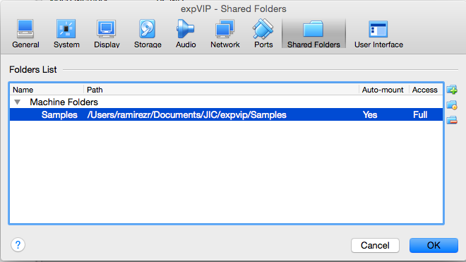

# Loading Virtual Machine #

The ```expVIP``` Virtual Machine (VM) allows you to analyse your own RNA-Seq expression experiments locally.  


## Requirements ##

The virtual machine requires:

* [VirtualBox](https://www.virtualbox.org), version 5 or newer.
* 6GB of RAM
* A 64-bit operating system running on an x86_64 architecture. (Intel, AMD)
* 10GB of free space. 


## Default data ##
The default values loaded in the virtual machine are available in this [link](https://www.dropbox.com/sh/n15tpsqj92wfn8u/AABivEEUj4sRd9tG830WnSi4a?dl=0). These correspond to the wheat data from Borrill, Ramirez-Gonzalez and Uauy, 2015 (_submitted_).

You can get a virtual machine with expVIP installed with either the wheat data preloaded or an empty database for your analysis [here](https://www.dropbox.com/sh/73i7ulj1hk6gdpd/AAARGuJDN0MnaZ7iLmMzSSp9a?dl=0).

### Available VMs ###
1. **expVIPNoData.ova** This VM is ready to use, but it has no data on it. You can load a custom set of RNA-seq reads, transcriptome reference and metadata. 
1. **expVIPwithWheatData.ova** This has all the data loaded from [www.wheat-expression.com](http://www.wheat-expression.com). You can add your own data and compare it with the values of publicly available experiments. 


## Setup shared folders ##

To load your custom RNA-seq experiments, you have to setup a shared folder with your input files. This shared folder will contain the data and information required by the VM to implement expVIP and it provides the "connection" between your computer and the VM. This shared folder should include:   

1. RNA-seq reads: as ```fastq``` or ```fq.gz``` files.
1. Transcriptome reference: currently only the cdna fasta file from ensembl is supported. 
1. Metadata: this includes two separate files; one factor file and one metadata file ([explained here] (https://github.com/homonecloco/expvip-web/wiki/LoadingMetadata)).  

Some important information:

* The shared folder must contain one sub-folder per each set of RNA-seq reads. So for example if you wish to analyse data from three samples, you will need three sub-folders (one each with the individual sample RNA-seq reads)
* Each RNA-seq sub-folder must be named with the same accession number that you use in your metadata (see [here] (https://github.com/homonecloco/expvip-web/wiki/LoadingMetadata)).
* If you wish to add your own wheat data to that previously provided in www.wheat-expression.com you will need to include sub-folders with your RNA-seq reads and then modify the metadata files: ```default_metadata.txt``` and ```FactorOrder.tsv``` which are provided in the ```expVIPwithWheatData.ova``` or can be downloaded [here](https://www.dropbox.com/sh/n15tpsqj92wfn8u/AABivEEUj4sRd9tG830WnSi4a?dl=0). Additional factors and metadata can be added at the end of these files following similar nomenclature as that already present in the files. 


## Loading the virtual machine ##

Download the ```ova``` virtual machine and double click it. Virtual Box will open it. Accept the default options. 

If The virtual machine is not loaded, go to the menu ```File``` and click ```Import appliance```. Open the ```.ova``` you want to use 


Availabe VMs:
* ```expVIP.ova``` expVIP is installed with an empty database. This VM requires to setup your own samples. 
* ```expVIPwithWheatData.ova``` expVIP is installed with the wheat expression data, transcriptome reference and metadata. This VM allows the inclusion of additional samples to integrate with the previously analysed wheat data.  

1. On the Oracle VM VirtualBox Manager select expVIP and click on the settings button

1. Click in ```Shared folders```

1. Add a new folder 

1. Search the ```Folder path``` with the experiments and the files with the metadata


1. Select the folder

1. Make sure that the ```Auto-mount``` option is selected. 

1. Accept the settings



## Starting the virtual machine ##
Select ```expVIP``` from the VM list and press start. 


## NOTES ##
[kallisto](http://pachterlab.github.io/kallisto/about.html) is included as part of the virtual machine and is free for non-commercial use. However, it requires a license for commercial use. The distribution of kallisto, with the corresponding license is included in ```~/software/``` in the VM.  


