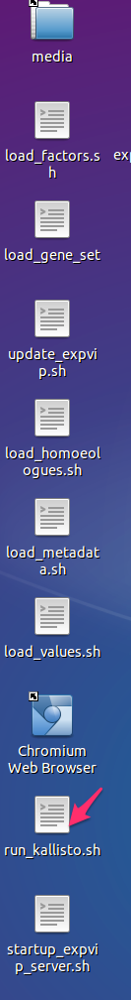
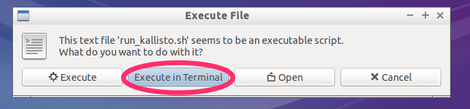
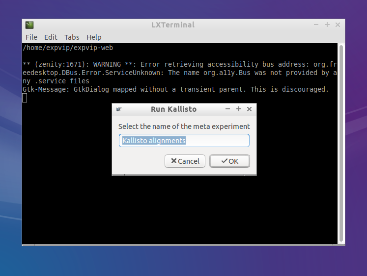
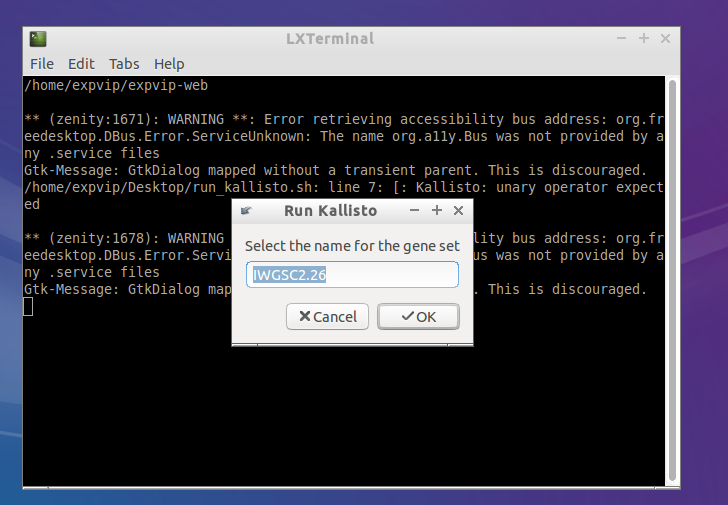
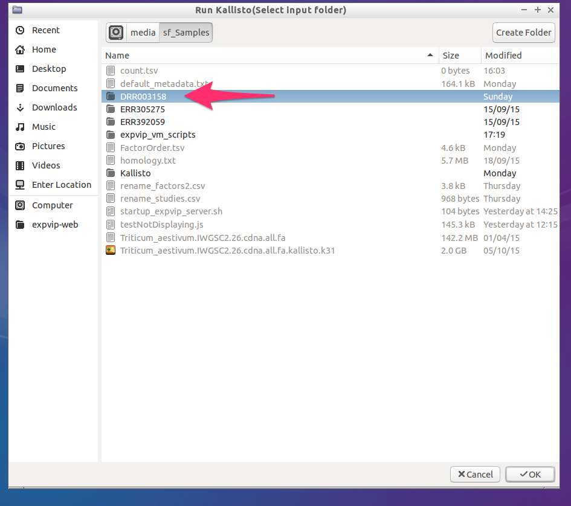
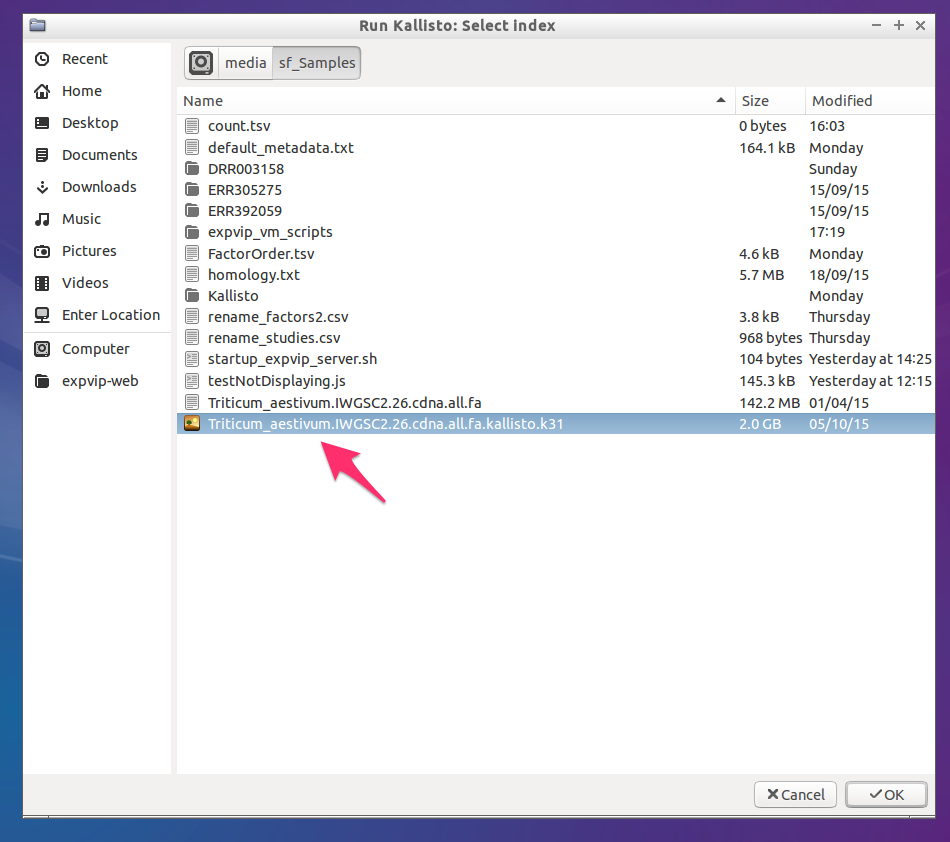
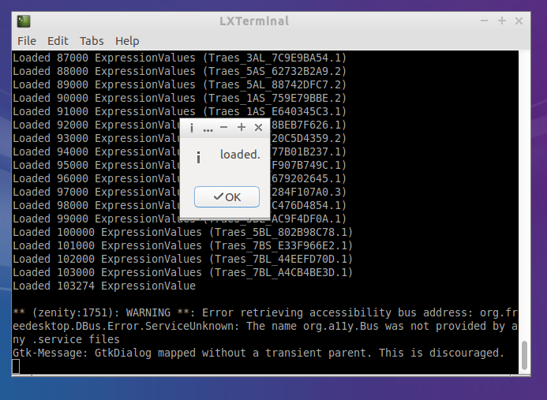

# Run Kallisto on a single sample #
expVIP can run ```Kallisto``` and load the ```tpm``` and ```counts``` to the database. The only requirement is to run ```kallisto index ``` on the transcriptome reference. 

## Graphical interface
1. Double click on ```run_kallisto.sh```

1. Click on ```Execute on terminal```

1. Give a name to the set of mappings to be grouped. All mappings done with the same reference and preference should have the same name. 

1. Get the name of the reference. This name must be the same used when loading the [metadata](LoadingMetadata) 

1. Select a folder with the reads. The reads must be paired reads. The folder name must be the same as the ```accession``` used on the metadata. 

1. Select the kallisto index

1. Wait for Kallisto to run and load the data


You can reepeat this with all the samples or you can use the [batch load](RunKallistoBatch). 

## Rake task ##


```sh
kallisto:runAndStorePaired[kallistoIndex,input_folder,metaExperimentName,geneSetName]
```

Where ```metaExperimentName``` is the name of the group of alignments under the same conditions and ```geneSetName`` is the name of the reference. 
