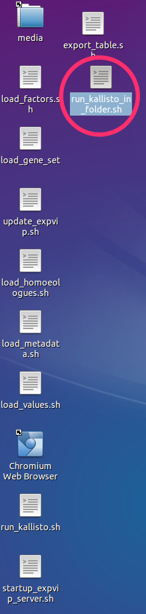
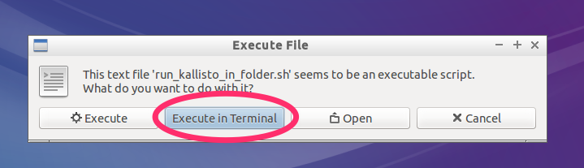
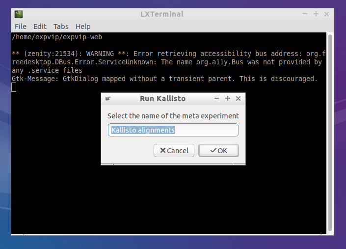
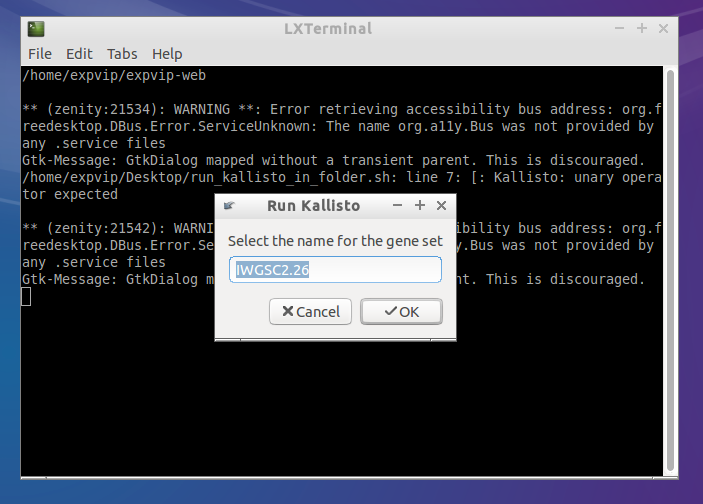
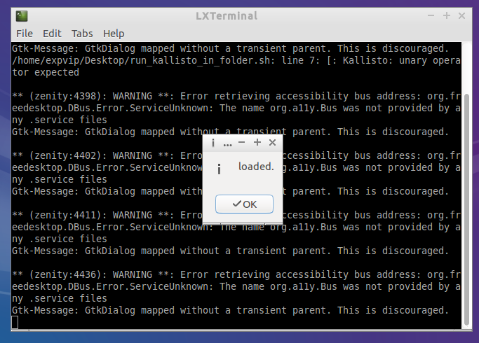

# Run Kallisto on a multiple samples #
expVIP can run ```Kallisto``` and load the ```tpm``` and ```counts``` to the database from multiple samples. The only requirement is to run ```kallisto index ``` on the transcriptome reference. 

## Graphical interface
1. Double click on ```run_kallisto.sh```

1. Click on ```Execute on terminal```

1. Give a name to the set of mappings to be grouped. All mappings done with the same reference and preference should have the same name. 

1. Get the name of the reference. This name must be the same used when loading the [metadata](LoadingMetadata) 

1. Select a folder with the folders containing the reads. The reads must be paired reads. The subfolder names must be the same as the ```accession``` used on the metadata.  If a subfolder has an experiment that has been loaded already, it is not loaded.

1. Select the kallisto index

1. Wait for Kallisto to run and load the data


Repeat this with all the samples. 

## Rake task ##


```sh
kallisto:runAndStorePairedFolder[kallistoIndex,input_folder,metaExperimentName,geneSetName]
```

Where ```metaExperimentName``` is the name of the group of alignments under the same conditions and ```geneSetName`` is the name of the reference. 
