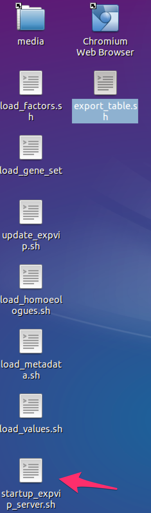
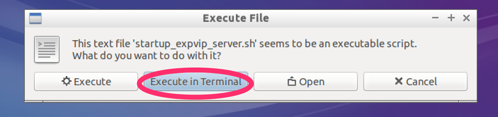
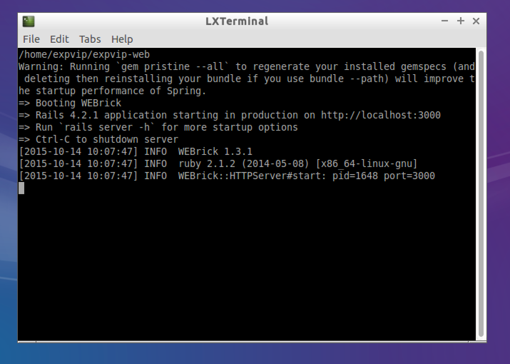
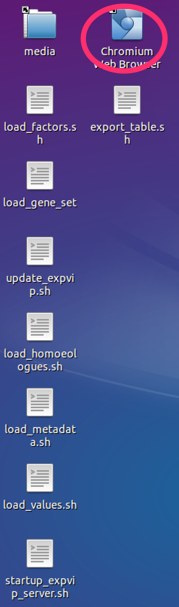
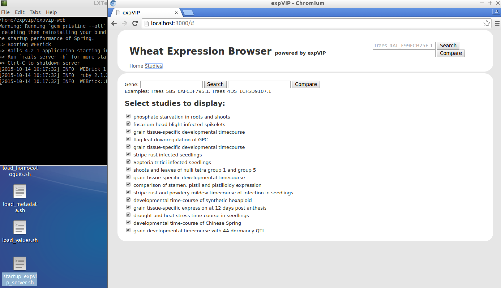

#Starting expVIP web server#

Once the data is loaded, you can visualize the the expression in the expVIP virtual machine.  

1. Double click on ```start_expvip_server.sh``` 

1. Click on ```Execute on terminal```

1. Wait fot the webserver to start. You know it is ready when the line ```WEBrickHTTPServer#start: pid=xxxx port=3000``` appers in the console 

1. Double click in Chromium Web Broser. 

1. Your local instance of expVIP is running! 

